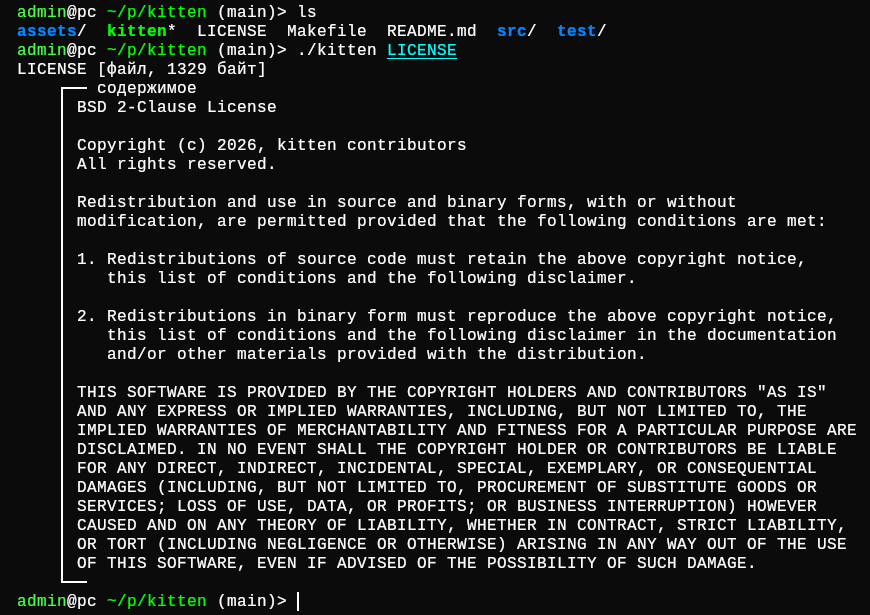

<div align="center">

# kitten

**A small C utility for readable snapshots of source trees.**

[](https://en.cppreference.com/w/c/99)
[](https://pubs.opengroup.org/onlinepubs/9699919799/)
[](DOCS.md#requirements)
[](LICENSE)

<br>



</div>

`kitten` combines a directory tree, file metadata, and inline text previews in
one terminal-friendly view. It is intended for inspecting small source trees,
preparing review context, and sharing bounded repository snapshots.

## Highlights

- previews readable files up to 256 KiB by default;
- identifies directories, regular files, symlinks, and special files;
- skips symlink traversal and checks opened files against inspected entries;
- escapes terminal control data unless raw content is explicitly requested;
- supports sorted or memory-bounded filesystem-order traversal;
- provides English and Russian diagnostics.

## Quick start

Build with a C99 compiler and `make`:

```sh
make
```

Inspect the current directory:

```sh
./kitten
```

Common variants:

```sh
./kitten --no-content src
./kitten -L 2 -m 64K path/to/project
./kitten --exclude=.git --exclude='*.o' --summary .
```

Install under `/usr/local`:

```sh
make
make install
```

See the [complete documentation](DOCS.md) for all options, traversal and
preview rules, architecture, portability, and packaging instructions.

## License

`kitten` is distributed under the [BSD 2-Clause License](LICENSE).

[Русская версия](README.ru.md)
