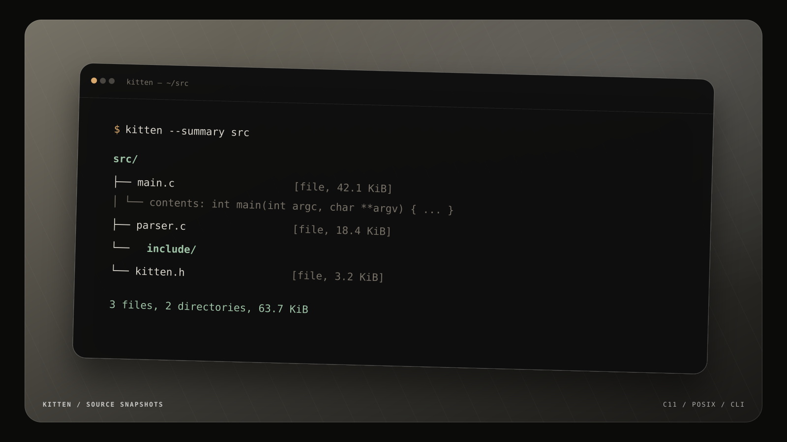

<div align="center">

# kitten

**A small C utility that prints source trees with file metadata and inline text previews.**

[](https://en.cppreference.com/w/c/11)
[](https://pubs.opengroup.org/onlinepubs/9699919799/)
[](#build)
[](LICENSE)

<br>



<br>

[`Quick start`](#quick-start) · [`Examples`](#examples) · [`Options`](#options) · [`Behavior`](#behavior)

</div>

## Why kitten?

Sometimes `tree` does not show enough and opening every file shows far too much. `kitten` sits between the two: it prints the structure, file sizes and readable text contents in one terminal-friendly snapshot.

| Tool | Tree structure | File metadata | Inline contents |
|:--|:--:|:--:|:--:|
| `tree` | ✓ | limited | — |
| `cat` | — | — | ✓ |
| **`kitten`** | ✓ | ✓ | ✓ |

It is useful for:

- inspecting small source trees;
- attaching readable context to bug reports;
- preparing code-review notes;
- sharing a project snapshot without opening every file;
- feeding a bounded amount of repository context into another tool.

> [!NOTE]
> `kitten` is intentionally conservative. It does not follow symlinks, skips binary and oversized content, and reports read failures through its exit status.

## Build

The whole program lives in one C file and has no third-party dependencies.

```sh
cc -std=c11 -Wall -Wextra -Wpedantic -O2 src/main.c -o kitten
```

It uses POSIX interfaces including `scandir`, `getline`, `fnmatch`, `lstat` and `readlink`.

## Quick start

```sh
# Inspect the current directory, including text contents
./kitten

# Inspect another project
./kitten path/to/project

# Print only the tree and metadata
./kitten --no-content src

# Skip generated files and print totals
./kitten --exclude=.git --exclude='*.o' --summary .
```

With one directory argument, `kitten` enters that directory before printing the tree. Multiple paths are printed as separate roots.

## Examples

### A compact source tree

```console
$ ./kitten --no-content src
./
├── include/
│   └── kitten.h [file, 3276 bytes]
├── main.c [file, 43108 bytes]
└── parser.c [file, 18842 bytes]
```

### Limit depth and content size

```sh
./kitten -L 2 -m 64K path/to/project
```

`-L 2` descends at most two directory levels. `-m 64K` caps each text preview at 64 KiB.

### Select what should be shown

```sh
./kitten --exclude=.git --exclude='build/*' --summary .
./kitten --content=never README.md src
./kitten --ascii --no-content .
```

Exclude patterns use shell-style wildcards and are matched against both names and paths. Repeat `--exclude` for more than one pattern.

## Options

| Option | Description |
|:--|:--|
| `-m BYTES`, `--max-bytes=BYTES` | Change the per-file preview limit. Accepts bytes or `K`, `M`, `G` suffixes. |
| `-L DEPTH`, `--depth=DEPTH` | Descend at most `DEPTH` directory levels. |
| `--exclude=PATTERN` | Skip matching names or paths. May be used more than once. |
| `--no-content` | Print only the tree and file metadata. |
| `--content=auto\|never` | Enable the default preview behavior or disable contents. |
| `--ascii` | Replace Unicode tree lines with portable ASCII characters. |
| `--summary` | Print directory, file, symlink, byte, skipped and error totals. |
| `-h`, `--help` | Print usage and exit. |

Both `--option=value` and the separated `--option value` form are accepted where a value is required.

## Behavior

### Text previews

- Text contents are shown by default.
- The default per-file limit is **256 KiB**.
- Files containing a NUL byte in the first 4096 bytes are marked as binary.
- Empty files, unreadable files and truncated previews receive explicit labels.
- `--no-content` and `--content=never` keep output to the tree and metadata.

### Traversal

- Entries are sorted alphabetically.
- `.` and `..` are ignored.
- Symlink targets are printed, but symlinked directories are never followed.
- Empty directories and special files are identified in the tree.
- `-L 0` prints only the root; `-L 1` includes its immediate children.
- Use `--` before a path that begins with a dash.

### Summary and exit status

`--summary` prints totals after traversal:

```text
summary:
  directories: 3
  files:       7
  symlinks:    0
  special:     0
  bytes:       68421
  skipped:     1
  errors:      0
```

| Status | Meaning |
|:--:|:--|
| `0` | Every requested path was inspected successfully. |
| `1` | Invalid arguments, an unreadable path or at least one traversal/read error. |

Skipped binary or oversized content is counted in the summary but is not treated as an error.

## Repository layout

```text
.
├── assets/
│   └── preview.png
├── src/
│   └── main.c
├── LICENSE
└── README.md
```

## License

`kitten` is available under the [BSD 2-Clause License](LICENSE).
