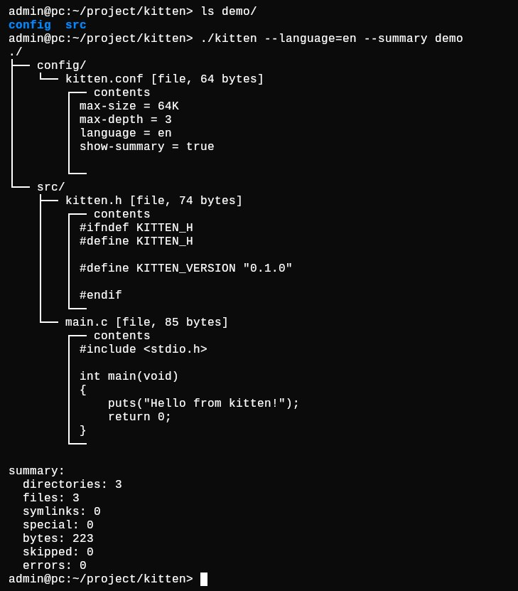

<div align="center">

# kitten

**Readable source-tree snapshots for the terminal**

[Documentation](docs/DOCS.md) •
[Русский](.github/README.ru.md) •
[Security](.github/SECURITY.md) •
[License](LICENSE)

<br>

[](docs/DOCS.md)
[](https://en.cppreference.com/w/c/99)
[](https://pubs.opengroup.org/onlinepubs/9699919799/)
[](docs/DOCS.md#requirements)
[](LICENSE)

<br>

<div align="center">

</div>

</div>

`kitten` combines a directory tree, file metadata, and inline text previews in
one terminal-friendly view. It is useful for inspecting small source trees,
preparing review context, and sharing bounded repository snapshots.

**Navigate:** [Features](#features) • [Quick start](#quick-start) •
[Usage](#usage) • [Installation](#installation) •
[Documentation](#documentation)

## Features

- previews readable files up to 256 KiB by default;
- identifies directories, regular files, symlinks, and special files;
- avoids symlink traversal and detects files replaced during inspection;
- escapes terminal control data unless raw output is explicitly requested;
- supports sorted and memory-bounded filesystem-order traversal;
- provides English and Russian diagnostics.

## Quick start

Building requires a C99 compiler and `make`:

```sh
make
./kitten
```

With no path, `kitten` inspects the current directory.

## Usage

```text
kitten [OPTION]... [PATH]...
```

| Command | Result |
|:--|:--|
| `./kitten --no-content src` | Print the tree and metadata without file previews. |
| `./kitten -L 2 -m 64K path/to/project` | Limit traversal depth and preview size. |
| `./kitten --exclude=.git --exclude='*.o' --summary .` | Exclude matching entries and print totals. |
| `./kitten --language=ru .` | Use Russian diagnostics and labels. |

Run `./kitten --help` for the complete option summary.

## Installation

The default installation prefix is `/usr/local`:

```sh
make
make install
```

Set `PREFIX` to use another hierarchy or `DESTDIR` to stage a package:

```sh
make PREFIX=/usr DESTDIR="$pkgdir" install
```

## Documentation

- [Complete documentation](docs/DOCS.md)
- [Manual page source](doc/kitten.1)
- [Texinfo manual source](doc/kitten.texi)
- [Security policy](.github/SECURITY.md)

## License

`kitten` is distributed under the [BSD 2-Clause License](LICENSE).
